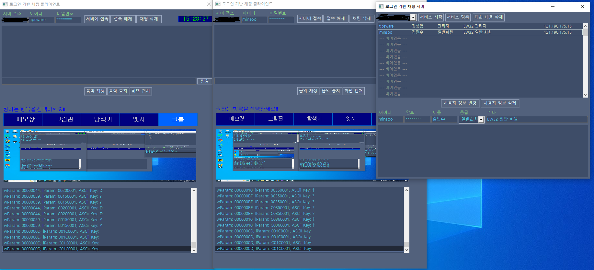
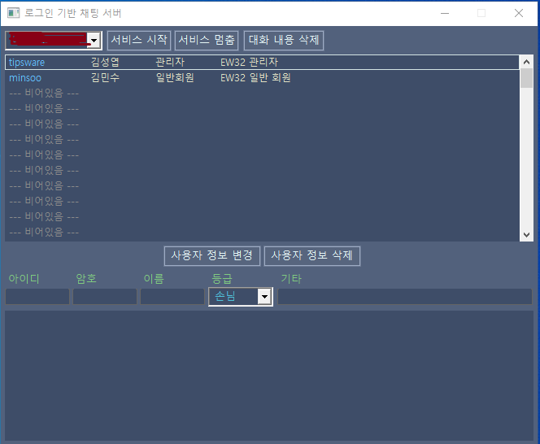
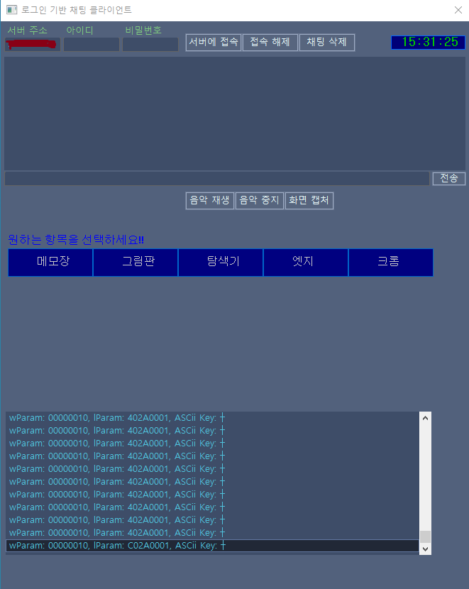

# 로그인 기반 채팅 프로그램<br>
## EW32 라이브러리를 활용한 클라이언트 - 서버 간의 소켓 통신 채팅 프로그램
### 진행 기간
> 24.4.7 ~ 24.4.21

### 사용 언어
 
<br>

### 진행한 챕터

<br>

### 기능
- 공통적인 부분은 대화창의 내용을 계속 스크롤하면서 보는 것이 귀찮을 수 있으니 대화 내용 삭제
- 클라이언트 같은 경우 음악 재생 및 중지, 실습 화면 캡처, 매크로를 활용한 프로그램 접속 추가, 시계 표시
- 서버 같은 경우 정보 변경 시 아이디 미입력 뿐만 아니라 비밀번호 미입력도 리스트 박스에 표시
- 클라이언트에도 서버 접속 시 아이디/패스워드 미입력, 잘못된 아이디/패스워드 입력에도 서버 접속 x
=> 메시지 박스를 각기 다르게 두어(접속 성공 -> MB_ICONINFORMATION, 실패 -> MB_ICONERROR) 표시
- 클라이언트 맨 하단 리스트 박스를 추가로 생성하여 사용자가 입력한 키에 대한 후킹 데이터를 표시할 수 있도록 함
- 클라이언트 상단 오른쪽에 이미지 애니메이션 표시

### 문제점 및 해결
- 아이디를 미입력한 경우에 이벤트 리스트 박스에 미입력 표시를 하였으나, 비밀번호 미입력한 경우에는 이벤트 리스트에 표시x
- 로직은 비밀번호가 존재하면 리스트 박스에 표시될 필요없이 입력한 비밀번호를 메모리에 저장
- 만약 비밀번호를 에디트 컨트롤에 입력하지 않을 시 리스트 박스에 미입력 표시를 함
```c
// 수정 전
if(CheckStringThatMakesUpID(id)) { // 아이디 문자 구성에 대한 유효성 체크
    if (len != p_user->info.id_len || memcmp(id, p_user->info.id, len)) { // 아이디 변경 여부 체크
        if (GetDupUserByID(&ap_app->server_data, p_user, id, len)) { // 이미 사용된 아이디인지 체크
            AddEventString(ap_app, "동일한 아이디가 존재해서 사용자 정보를 변경할 수 없습니다.");
            return;
        }
        p_user->info.id_len = len; // 아이디 길이 저장
        memcpy(p_user->info.id, id, len + 1); // 아이디 저장
    }
  ... (코드 중략)...
}
else AddEventString(ap_app, "아이디 오류: 아이디는 반드시 입력해야 합니다."); // 아이디 미입력 처리
// 아이디 미입력 처리만 하였을 뿐 비밀번호 미입력 여부는 표시하지 않음

// 수정 후
if(CheckStringThatMakesUpID(id)) { // 아이디 문자 구성에 대한 유효성 체크
    if (len != p_user->info.id_len || memcmp(id, p_user->info.id, len)) { // 아이디 변경 여부 체크
        if (GetDupUserByID(&ap_app->server_data, p_user, id, len)) { // 이미 사용된 아이디인지 체크
            AddEventString(ap_app, "동일한 아이디가 존재해서 사용자 정보를 변경할 수 없습니다.");
            return;
        }
        p_user->info.id_len = len; // 아이디 길이 저장
        memcpy(p_user->info.id, id, len + 1); // 아이디 저장
    }
  ... (코드 중략)...
}
else AddEventString(ap_app, "아이디 오류: 아이디는 반드시 입력해야 합니다."); // 아이디 미입력 처리
if (pw_len) {
    p_user->info.password_len = pw_len;
    memcpy(p_user->info.password, pw, pw_len + 1);
}
else AddEventString(ap_app, "패스워드 미입력: 패스워드는 반드시 입력해야 합니다!"); // 비밀번호 미입력 처리
```

### 또 다른 문제점 및 해결
- 프로그램을 실행하고 user.dat 파일을 모두 지운 상태 -> 동일한 비밀번호 사용 라는 메시지 계속 출력
- &&, || 연산자를 사용해서 해결하려고 했으나 모두 원하는 값을 도출하지 못함
- 임시 방편으로 비밀번호가 미입력 되어 있는 상태만 출력
- 에디트 컨트롤에 남아 있는 아이디, 비밀번호, 이름, 기타 정보 삭제하는 코드를 다시 구성
